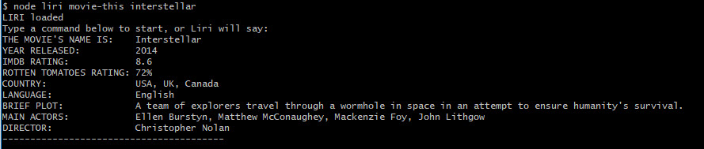

# LIRI-Bot
LIRI is like iPhone's SIRI. However, while SIRI is a Speech Interpretation and Recognition Interface, LIRI is a Language Interpretation and Recognition Interface. LIRI will be a command line node app that takes in parameters and gives you back data.

This App is the result of a homework assignment during UNC-Charlotte's Web Coding BootCamp in summer of 2019. The main point being to learn to use the technologies and practices listed below. Other than consulting with classmates on an issue or two where I got stuck, this app is the result of my own work. 

# TECHNOLOGIES
<ul>
<li>JavaScript
<li>Nodejs
<li>Node Packages - these are listed in the package.json file, so you should be able to install then all with `npm install`
    <ul>
    <li>Axios
    <li>DOTENV
    <li>Momentjs
    <li>Node-Spotify-api
    <li>Chalk
    </ul>
<li>APIs
    <ul>
    <li>Bands In Town (via Axios)
    <li>OMDB (via Axios)
    <li>SPOTIFY
    </ul>
<li>Use of .gitignore and other files to keep my API keys secure
<li>Use of the fs Node package to read from a file
</ul>

# Instructions
<h3>Access your computer's command line</h3>

<h3>To get onscreen instructions, type:</h3>
<h4>`node liri`</h4>

<h3>Next, type one of the commands shown</h3>

# What the Commands Do
<ul>
    <li>node liri concert-this <band name>  - A query will be sent to Bands In Town (via Axios) to locate upcoming live concerts. If concerts are found, the list will be displayed. At this time, the app cannot search a specific place. 
    <li> node liri spotify-this <song name> - A query will be sent to Spotify to find the song you request. You are likely to get more results than you expect. As long as there <strong>are</strong> results, up to twenty will be displayed in an orderly manner for you. 
    <li>node liri movie-this <movie name> - A query will be sent to the OMDB (via Axios) to find the movie you request. Available results will be displayed in an orderly manner for you. 
    <li>node liri do-this - What could this be? Type it and get a random result! At this time, there is only ONE random request. Maybe more later!
        </ul>
